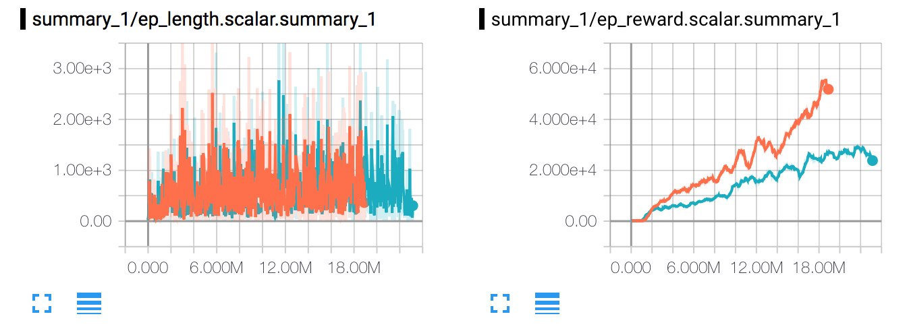
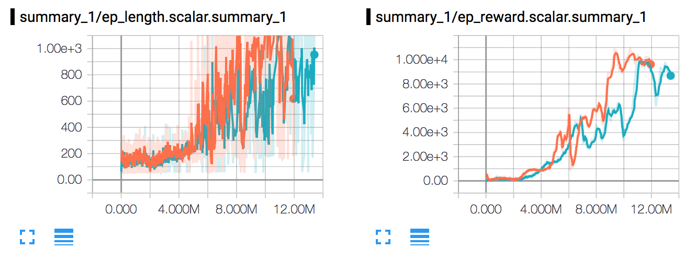
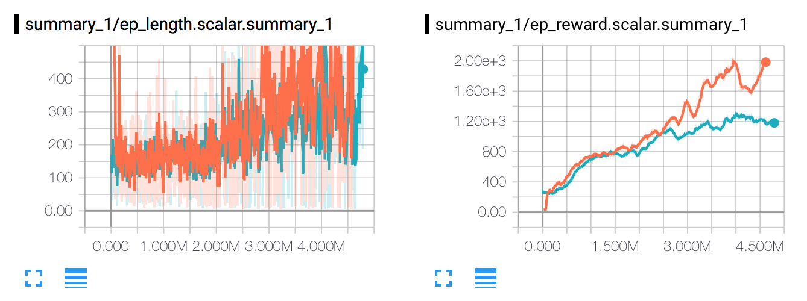
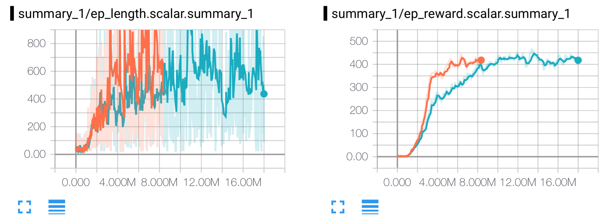
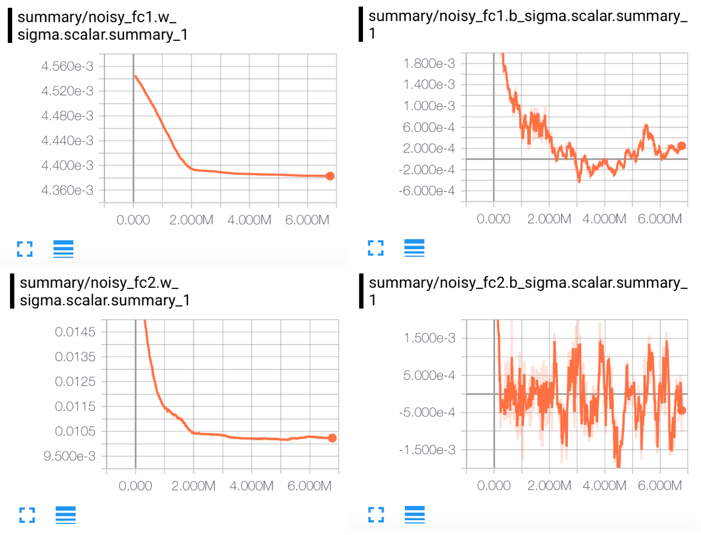

# NoisyNet-DQN

[](LICENSE)

I implement the [NoisyNet](https://arxiv.org/abs/1706.10295) for DQN-based RL algorithms. The code is evaluated on Atari2000, which is commonly used to benchmark the RL algorithms. Also, the tensorflow summary is added to better visualize the training process. More about my notes for NoisyNet can be found at [@andrewliao11/Deep-Reinforcement-Learning-Survey](https://github.com/andrewliao11/Deep-Reinforcement-Learning-Survey/blob/master/papers/Noisy%20Networks%20for%20Exploration.md)

Disclaimer: this code is highly based on [@openai/baselines](https://github.com/openai/baselines). Thanks for the great works!

## Benchmarking Environment

I train and evaluate on the following environments:


## Results

**orange: NoisyNet-DQN; blue: DQN**

Experiment on Atlantis-NoFrameskip-v4:


Experiment on DoubleDunk-NoFrameskip-v4:


Experiment on DemonAttack-NoFrameskip-v4:


Experiment on Kangaroo-NoFrameskip-v4:


Experiment on Assault-NoFrameskip-v4:


Experiment on Breakout-NoFrameskip-v4:


Other experiment results will be added soon :fire: (Benchmarking takes time so be patient.)

Note that I pick the environment that is favorable to NoisyNet, according to the paper experiment. In some specific environment, NoisyNet will result in equal or even worse peformance. (You are suggestted to read the paper if you're interested in this repo.)

The corresponding event files can be found at [drive](https://drive.google.com/drive/folders/0B3fKFm-j0RqeR1V0VTRxUExGYzA?usp=sharing)

## The decreasing \sigma?

Different from OpenAI's [paper](https://arxiv.org/abs/1706.01905), DM's paper uses learnable parameter to determine the scale of the noise. So, you might curious about the scale of the \sigma. Here, I train NoisyNet-DQN on ```DoubleDunk-NoFrameskip-v4``` and record the mean of the \sigma:



## Usage

First, copy the modified files to openai baselines (to support NoisyNet)
```bash
git clone --recursive https://github.com/andrewliao11/NoisyNet-DQN.git
cd NoisyNet-DQN
cp build_graph.py ./baselines/baselines/deepq/build_graph.py
cp tf_util.py ./baselines/baselines/common/tf_util.py
```

And add this line to your .bashrc (append to the PYTHONPATH)
```bash
export PYTHONPATH="PATH-TO-NoisyNet-DQN/baselines:$PYTHONPATH"
```

Train the agent and be patient
```bash
# with NoisyNet-DQN
python train.py --env Breakout --no-double-q --noisy --save-dir MODEL_PATH
# with vanilla DQN
python train.py --env Breakout --no-double-q --save-dir MODEL_PATH
```

## Basic requirement
- tensorflow
- python > 3.5
- gym[atari]

# Acknowledgements
- @openai/baselines

## Reference
- Noisy Networks for Exploration
- Human-level control through deep reinforcement learning
- Deep Reinforcement Learning with Double Q-learning
- Dueling Network Architectures for Deep Reinforcement Learning
